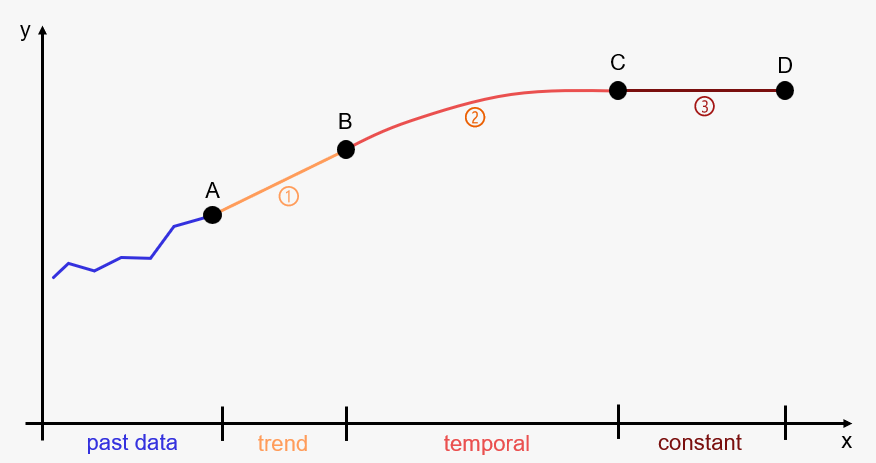
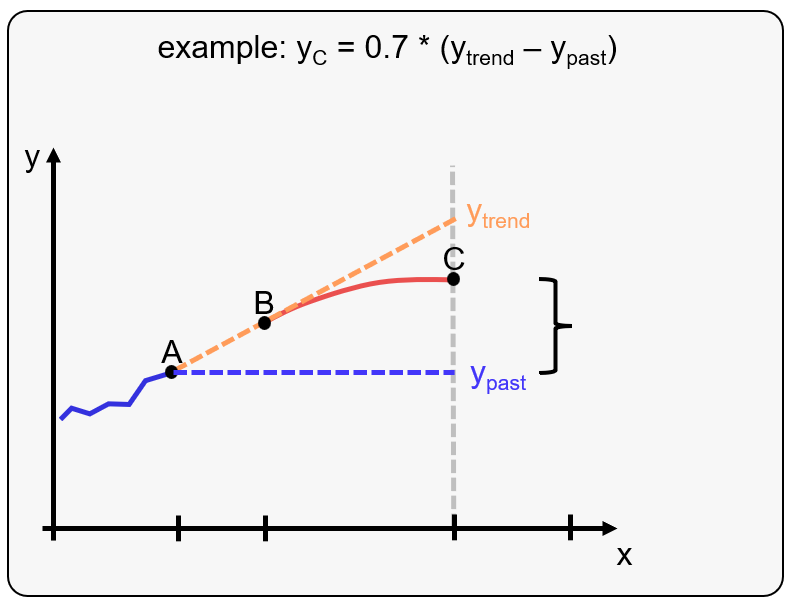

```{r, include = FALSE}
knitr::opts_chunk$set(
  collapse = TRUE,
  comment = "#>"
)
```

## Overview

First, TFR (total fertility rate) and MAB (mean age of the mother at birth) forecasts are calculated. In general, the FSO uses the **same model structure** for both forecasts. However, different model types and parameters can be used for the TFR and MAB forecast.

The FSO model for TFR and MAB consists of three time periods


-   **trend** period: in the FSO model usually a few years (one to five years)
-   **temporal** period: the majority of forecast period (FSO: approximately until 2055)
-   **constant** period: end of the for forecast (FSO: until 2075)


```{r fig-time-periods, echo=FALSE, out.width='70%', fig.cap="time periods"}



```


```{r fig-point-C, echo=FALSE, out.width='50%', fig.cap="data driven approach"}



```


```{r setup}
library(propopbirth)
```


